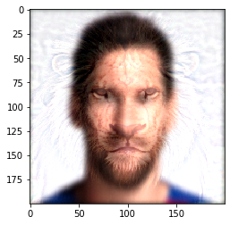

Hybrid Images

Filtering images and generating a hybrid out of them

To get the hybrid image, I added the high pass of one image to the low pass of the other. Multiplying both by some ratio based on Trial and error.

The low pass is calculated by convolving the image using the Gaussian Blur Kernel. While the high pass is the differnece between the original image and the low pass.

Convolving images is done by mirroring the kernel up-down and left-right, and then calculating the cross correlation of the image passing the mirrored kernel.

